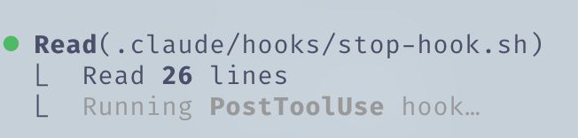

# Everything Claude Code 단기 가이드


---

**2월 실험적 롤아웃 이후 Claude Code를 열심히 사용해왔으며, [@DRodriguezFX](https://x.com/DRodriguezFX)와 함께 전적으로 Claude Code를 사용하여 [zenith.chat](https://zenith.chat)으로 Anthropic x Forum Ventures 해커톤에서 우승했습니다.**

10개월간의 일상 사용 이후 완전한 셋업을 공개합니다: 스킬, 훅, 서브에이전트, MCP, 플러그인, 그리고 실제로 효과적인 것들.

---

## 스킬과 명령어

스킬은 특정 범위와 워크플로우로 제한된 규칙처럼 작동합니다. 특정 워크플로우를 실행해야 할 때 프롬프트의 약식 표현입니다.

Opus 4.5로 긴 코딩 세션 후 죽은 코드와 느슨한 .md 파일을 정리하고 싶나요? `/refactor-clean`을 실행하세요. 테스팅이 필요하다면? `/tdd`, `/e2e`, `/test-coverage`. 스킬에는 코드맵도 포함될 수 있습니다 — Claude가 컨텍스트를 소비하지 않고 빠르게 코드베이스를 탐색하는 방법입니다.


*명령어 연쇄하기*

명령어는 슬래시 명령어로 실행되는 스킬입니다. 겹치는 부분이 있지만 다르게 저장됩니다:

- **스킬**: `~/.claude/skills/` - 더 광범위한 워크플로우 정의
- **명령어**: `~/.claude/commands/` - 빠르게 실행 가능한 프롬프트

```bash
# 예시 스킬 구조
~/.claude/skills/
  pmx-guidelines.md      # 프로젝트별 패턴
  coding-standards.md    # 언어 모범 사례
  tdd-workflow/          # README.md가 있는 멀티 파일 스킬
  security-review/       # 체크리스트 기반 스킬
```

---

## 훅

훅은 특정 이벤트에 반응하여 실행되는 트리거 기반 자동화입니다. 스킬과 달리 도구 호출과 라이프사이클 이벤트로 제한됩니다.

**훅 타입:**

1. **PreToolUse** - 도구 실행 전 (검증, 리마인더)
2. **PostToolUse** - 도구 완료 후 (포맷팅, 피드백 루프)
3. **UserPromptSubmit** - 메시지를 보낼 때
4. **Stop** - Claude가 응답을 마칠 때
5. **PreCompact** - 컨텍스트 압축 전
6. **Notification** - 권한 요청

**예시: 장시간 실행 명령어 전 tmux 리마인더**

```json
{
  "PreToolUse": [
    {
      "matcher": "tool == \"Bash\" && tool_input.command matches \"(npm|pnpm|yarn|cargo|pytest)\"",
      "hooks": [
        {
          "type": "command",
          "command": "if [ -z \"$TMUX\" ]; then echo '[Hook] 세션 지속성을 위해 tmux 사용을 고려하세요' >&2; fi"
        }
      ]
    }
  ]
}
```


*PostToolUse 훅 실행 시 Claude Code에서 받는 피드백 예시*

**팁:** JSON을 수동으로 작성하는 대신 `hookify` 플러그인을 사용하여 대화형으로 훅을 만드세요. `/hookify`를 실행하고 원하는 것을 설명하세요.

---

## 서브에이전트

서브에이전트는 오케스트레이터(메인 Claude)가 제한된 범위로 작업을 위임할 수 있는 프로세스입니다. 백그라운드 또는 포그라운드에서 실행되어 메인 에이전트의 컨텍스트를 확보합니다.

서브에이전트는 스킬과 잘 작동합니다 — 스킬의 일부를 실행할 수 있는 서브에이전트는 해당 스킬을 자율적으로 사용하여 작업을 위임받을 수 있습니다. 또한 특정 도구 권한으로 샌드박스화될 수 있습니다.

```bash
# 예시 서브에이전트 구조
~/.claude/agents/
  planner.md           # 기능 구현 계획
  architect.md         # 시스템 설계 결정
  tdd-guide.md         # 테스트 주도 개발
  code-reviewer.md     # 품질/보안 리뷰
  security-reviewer.md # 취약점 분석
  build-error-resolver.md
  e2e-runner.md
  refactor-cleaner.md
```

서브에이전트별로 허용 도구, MCP, 권한을 적절한 범위로 설정하세요.

---

## 규칙과 메모리

`.rules` 폴더에는 Claude가 항상 따라야 하는 모범 사례가 담긴 `.md` 파일이 있습니다. 두 가지 접근 방식:

1. **단일 CLAUDE.md** - 모든 것을 한 파일에 (사용자 또는 프로젝트 수준)
2. **규칙 폴더** - 관심사별로 그룹화된 모듈식 `.md` 파일

```bash
~/.claude/rules/
  security.md      # 하드코딩된 시크릿 없음, 입력값 검증
  coding-style.md  # 불변성, 파일 구성
  testing.md       # TDD 워크플로우, 80% 커버리지
  git-workflow.md  # 커밋 형식, PR 프로세스
  agents.md        # 서브에이전트에 위임할 시기
  performance.md   # 모델 선택, 컨텍스트 관리
```

**예시 규칙:**

- 코드베이스에 이모지 없음
- 프론트엔드에 보라색 계열 사용 자제
- 배포 전 항상 코드 테스트
- 메가 파일보다 모듈식 코드 우선
- console.log 커밋 금지

---

## MCP (Model Context Protocol)

MCP는 Claude를 외부 서비스에 직접 연결합니다. API를 대체하는 것이 아닌 — 정보 탐색에 더 많은 유연성을 제공하는 프롬프트 기반 래퍼입니다.

**예시:** Supabase MCP는 Claude가 특정 데이터를 가져오고, 복사-붙여넣기 없이 SQL을 직접 실행할 수 있게 합니다. 데이터베이스, 배포 플랫폼 등도 마찬가지입니다.


*공개 스키마 내 테이블을 나열하는 Supabase MCP 예시*

**Chrome in Claude:** Claude가 브라우저를 자율적으로 제어할 수 있는 내장 플러그인 MCP입니다 — 어떻게 작동하는지 보기 위해 클릭.

**중요: 컨텍스트 윈도우 관리**

MCP는 선별적으로 사용하세요. 모든 MCP를 사용자 설정에 두되 **사용하지 않는 것은 모두 비활성화**합니다. `/plugins`로 이동하여 스크롤하거나 `/mcp`를 실행하세요.


*/plugins를 사용하여 MCP로 이동하고 현재 설치된 MCP와 상태 확인*

너무 많은 도구가 활성화되면 200k 컨텍스트 윈도우가 압축 전 70k로 줄어들 수 있습니다. 성능이 크게 저하됩니다.

**기본 원칙:** 설정에 20~30개의 MCP를 두되, 10개 미만 활성화 / 80개 미만 도구 활성화.

```bash
# 활성화된 MCP 확인
/mcp

# ~/.claude.json의 projects.disabledMcpServers에서 사용하지 않는 것 비활성화
```

---

## 플러그인

플러그인은 번거로운 수동 설정 대신 쉽게 설치할 수 있도록 도구를 패키징합니다. 플러그인은 스킬 + MCP의 조합이거나 훅/도구가 번들로 묶인 것일 수 있습니다.

**플러그인 설치:**

```bash
# 마켓플레이스 추가
claude plugin marketplace add https://github.com/mixedbread-ai/mgrep

# Claude 열고, /plugins 실행, 새 마켓플레이스 찾기, 거기서 설치
```


*새로 설치된 Mixedbread-Grep 마켓플레이스 표시*

**LSP 플러그인**은 Claude Code를 편집기 외부에서 자주 실행하는 경우 특히 유용합니다. Language Server Protocol은 IDE 없이도 Claude에 실시간 타입 검사, 정의로 이동, 지능적인 완성을 제공합니다.

```bash
# 활성화된 플러그인 예시
typescript-lsp@claude-plugins-official  # TypeScript 인텔리전스
pyright-lsp@claude-plugins-official     # Python 타입 검사
hookify@claude-plugins-official         # 대화형으로 훅 생성
mgrep@Mixedbread-Grep                   # grep보다 나은 검색
```

MCP와 동일한 주의사항 — 컨텍스트 윈도우를 주시하세요.

---

## 팁과 트릭

### 키보드 단축키

- `Ctrl+U` - 전체 줄 삭제 (백스페이스 연타보다 빠름)
- `!` - 빠른 bash 명령어 접두사
- `@` - 파일 검색
- `/` - 슬래시 명령어 시작
- `Shift+Enter` - 멀티라인 입력
- `Tab` - 사고 표시 토글
- `Esc Esc` - Claude 중단 / 코드 복원

### 병렬 워크플로우

- **포크** (`/fork`) - 대화를 포크하여 대기 중인 메시지를 스팸하는 대신 겹치지 않는 작업을 병렬로 수행
- **Git Worktree** - 충돌 없이 병렬 Claude를 위해. 각 워크트리는 독립적인 체크아웃

```bash
git worktree add ../feature-branch feature-branch
# 이제 각 워크트리에서 별도의 Claude 인스턴스 실행
```

### 장시간 실행 명령어를 위한 tmux

Claude가 실행하는 로그/bash 프로세스 스트리밍 및 감시:

https://github.com/user-attachments/assets/shortform/07-tmux-video.mp4

```bash
tmux new -s dev
# Claude가 여기서 명령어를 실행, 분리했다가 다시 연결 가능
tmux attach -t dev
```

### mgrep > grep

`mgrep`은 ripgrep/grep에서 크게 개선되었습니다. 플러그인 마켓플레이스를 통해 설치하고 `/mgrep` 스킬을 사용하세요. 로컬 검색과 웹 검색 모두 작동합니다.

```bash
mgrep "function handleSubmit"  # 로컬 검색
mgrep --web "Next.js 15 app router changes"  # 웹 검색
```

### 기타 유용한 명령어

- `/rewind` - 이전 상태로 되돌아가기
- `/statusline` - 브랜치, 컨텍스트 %, 할 일 목록으로 커스터마이즈
- `/checkpoints` - 파일 수준 실행 취소 지점
- `/compact` - 수동으로 컨텍스트 압축 트리거

### GitHub Actions CI/CD

GitHub Actions로 PR에 코드 리뷰를 설정하세요. 설정하면 Claude가 자동으로 PR을 리뷰할 수 있습니다.


*버그 수정 PR을 승인하는 Claude*

### 샌드박싱

위험한 작업에는 샌드박스 모드를 사용하세요 — Claude가 실제 시스템에 영향을 주지 않는 제한된 환경에서 실행됩니다.

---

## 편집기에 대하여

편집기 선택은 Claude Code 워크플로우에 크게 영향을 줍니다. Claude Code는 모든 터미널에서 작동하지만, 유능한 편집기와 함께 사용하면 실시간 파일 추적, 빠른 탐색, 통합 명령어 실행이 가능합니다.

### Zed (제가 선호하는 것)

저는 [Zed](https://zed.dev)를 사용합니다 — Rust로 작성되어 진정으로 빠릅니다. 즉시 열리고, 거대한 코드베이스도 문제없이 처리하며, 시스템 리소스를 거의 사용하지 않습니다.

**Zed + Claude Code가 훌륭한 조합인 이유:**

- **속도** - Rust 기반 성능으로 Claude가 빠르게 파일을 편집할 때 지연 없음. 편집기가 따라옴
- **에이전트 패널 통합** - Zed의 Claude 통합으로 Claude가 편집하는 동안 실시간으로 파일 변경 추적. Claude가 참조하는 파일 간을 편집기에서 나가지 않고 이동
- **CMD+Shift+R 명령어 팔레트** - 검색 가능한 UI에서 모든 커스텀 슬래시 명령어, 디버거, 빌드 스크립트에 빠른 접근
- **최소 리소스 사용** - 무거운 작업 중 Claude와 RAM/CPU를 경쟁하지 않음. Opus 실행 시 중요
- **Vim 모드** - 원하는 경우 완전한 vim 키 바인딩


*CMD+Shift+R을 사용한 커스텀 명령어 드롭다운이 있는 Zed 편집기. 오른쪽 하단의 과녁 모양이 Following 모드.*

**편집기 무관 팁:**

1. **화면 분할** - 한쪽에 Claude Code가 있는 터미널, 다른 쪽에 편집기
2. **Ctrl + G** - Zed에서 Claude가 현재 작업 중인 파일을 빠르게 열기
3. **자동 저장** - Claude의 파일 읽기가 항상 최신 상태가 되도록 자동 저장 활성화
4. **Git 통합** - 편집기의 git 기능을 사용하여 커밋 전 Claude의 변경사항 검토
5. **파일 감시기** - 대부분의 편집기가 변경된 파일을 자동으로 다시 로드, 이것이 활성화되어 있는지 확인

### VSCode / Cursor

이것도 실행 가능한 선택으로 Claude Code와 잘 작동합니다. `\ide`를 사용하여 터미널 형식으로 사용할 수 있으며, LSP 기능을 편집기와 자동으로 동기화합니다 (이제 플러그인과 어느 정도 중복됨). 또는 편집기와 더 통합되고 일치하는 UI가 있는 확장 프로그램을 선택할 수 있습니다.


*VS Code 확장 프로그램은 IDE에 직접 통합된 Claude Code의 네이티브 그래픽 인터페이스를 제공합니다.*

---

## 나의 셋업

### 플러그인

**설치됨:** (보통 한 번에 4~5개만 활성화)

```markdown
ralph-wiggum@claude-code-plugins       # 루프 자동화
frontend-design@claude-code-plugins    # UI/UX 패턴
commit-commands@claude-code-plugins    # Git 워크플로우
security-guidance@claude-code-plugins  # 보안 검사
pr-review-toolkit@claude-code-plugins  # PR 자동화
typescript-lsp@claude-plugins-official # TS 인텔리전스
hookify@claude-plugins-official        # 훅 생성
code-simplifier@claude-plugins-official
feature-dev@claude-code-plugins
explanatory-output-style@claude-code-plugins
code-review@claude-code-plugins
context7@claude-plugins-official       # 라이브 문서
pyright-lsp@claude-plugins-official    # Python 타입
mgrep@Mixedbread-Grep                  # 더 나은 검색
```

### MCP 서버

**설정됨 (사용자 수준):**

```json
{
  "github": { "command": "npx", "args": ["-y", "@modelcontextprotocol/server-github"] },
  "firecrawl": { "command": "npx", "args": ["-y", "firecrawl-mcp"] },
  "supabase": {
    "command": "npx",
    "args": ["-y", "@supabase/mcp-server-supabase@latest", "--project-ref=YOUR_REF"]
  },
  "memory": { "command": "npx", "args": ["-y", "@modelcontextprotocol/server-memory"] },
  "sequential-thinking": {
    "command": "npx",
    "args": ["-y", "@modelcontextprotocol/server-sequential-thinking"]
  },
  "vercel": { "type": "http", "url": "https://mcp.vercel.com" },
  "railway": { "command": "npx", "args": ["-y", "@railway/mcp-server"] },
  "cloudflare-docs": { "type": "http", "url": "https://docs.mcp.cloudflare.com/mcp" },
  "cloudflare-workers-bindings": {
    "type": "http",
    "url": "https://bindings.mcp.cloudflare.com/mcp"
  },
  "clickhouse": { "type": "http", "url": "https://mcp.clickhouse.cloud/mcp" },
  "AbletonMCP": { "command": "uvx", "args": ["ableton-mcp"] },
  "magic": { "command": "npx", "args": ["-y", "@magicuidesign/mcp@latest"] }
}
```

핵심은 이것입니다 — 14개의 MCP가 설정되어 있지만 프로젝트당 ~5~6개만 활성화합니다. 컨텍스트 윈도우를 건강하게 유지합니다.

### 주요 훅

```json
{
  "PreToolUse": [
    { "matcher": "npm|pnpm|yarn|cargo|pytest", "hooks": ["tmux 리마인더"] },
    { "matcher": "Write && .md file", "hooks": ["README/CLAUDE가 아니면 차단"] },
    { "matcher": "git push", "hooks": ["리뷰를 위해 편집기 열기"] }
  ],
  "PostToolUse": [
    { "matcher": "Edit && .ts/.tsx/.js/.jsx", "hooks": ["prettier --write"] },
    { "matcher": "Edit && .ts/.tsx", "hooks": ["tsc --noEmit"] },
    { "matcher": "Edit", "hooks": ["console.log 경고 grep"] }
  ],
  "Stop": [
    { "matcher": "*", "hooks": ["수정된 파일에서 console.log 확인"] }
  ]
}
```

### 커스텀 상태표시줄

사용자, 디렉토리, 더티 표시가 있는 git 브랜치, 남은 컨텍스트 %, 모델, 시간, 할 일 개수를 표시합니다:


*Mac 루트 디렉토리에서의 상태표시줄 예시*

```
affoon:~ ctx:65% Opus 4.5 19:52
▌▌ plan mode on (shift+tab to cycle)
```

### 규칙 구조

```
~/.claude/rules/
  security.md      # 필수 보안 검사
  coding-style.md  # 불변성, 파일 크기 제한
  testing.md       # TDD, 80% 커버리지
  git-workflow.md  # Conventional Commits
  agents.md        # 서브에이전트 위임 규칙
  patterns.md      # API 응답 형식
  performance.md   # 모델 선택 (Haiku vs Sonnet vs Opus)
  hooks.md         # 훅 문서
```

### 서브에이전트

```
~/.claude/agents/
  planner.md           # 기능 분해
  architect.md         # 시스템 설계
  tdd-guide.md         # 테스트 먼저 작성
  code-reviewer.md     # 품질 리뷰
  security-reviewer.md # 취약점 스캔
  build-error-resolver.md
  e2e-runner.md        # Playwright 테스트
  refactor-cleaner.md  # 죽은 코드 제거
  doc-updater.md       # 문서 동기화 유지
```

---

## 핵심 요점

1. **과도하게 복잡하게 만들지 말 것** - 설정을 아키텍처가 아닌 미세 조정처럼 취급
2. **컨텍스트 윈도우는 소중함** - 사용하지 않는 MCP와 플러그인 비활성화
3. **병렬 실행** - 대화 포크, git 워크트리 사용
4. **반복적인 것 자동화** - 포맷팅, 린팅, 리마인더를 위한 훅
5. **서브에이전트 범위 지정** - 제한된 도구 = 집중된 실행

---

## 참고자료

- [플러그인 참고자료](https://code.claude.com/docs/en/plugins-reference)
- [훅 문서](https://code.claude.com/docs/en/hooks)
- [체크포인팅](https://code.claude.com/docs/en/checkpointing)
- [인터랙티브 모드](https://code.claude.com/docs/en/interactive-mode)
- [메모리 시스템](https://code.claude.com/docs/en/memory)
- [서브에이전트](https://code.claude.com/docs/en/sub-agents)
- [MCP 개요](https://code.claude.com/docs/en/mcp-overview)

---

**참고:** 이것은 세부 내용의 일부입니다. 고급 패턴은 [롱폼 가이드](./the-longform-guide.md)를 참조하세요.

---

*[@DRodriguezFX](https://x.com/DRodriguezFX)와 함께 NYC에서 [zenith.chat](https://zenith.chat)을 만들어 Anthropic x Forum Ventures 해커톤에서 우승*
